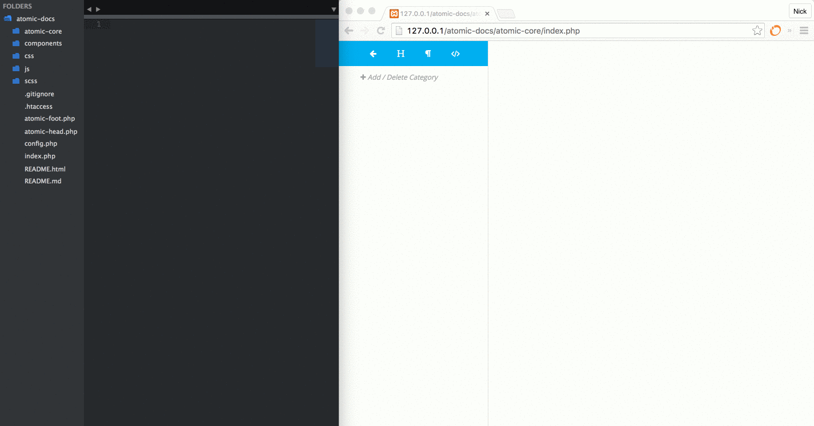
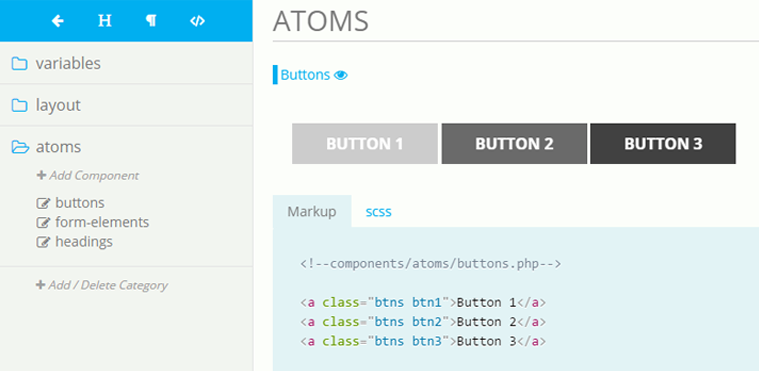
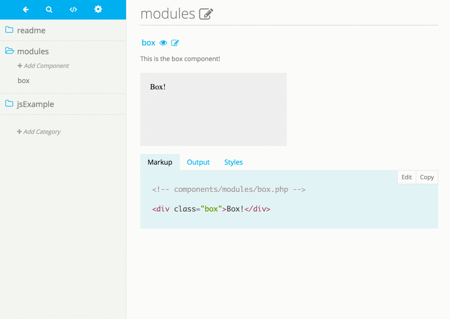
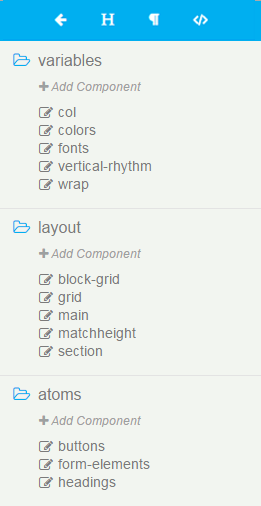
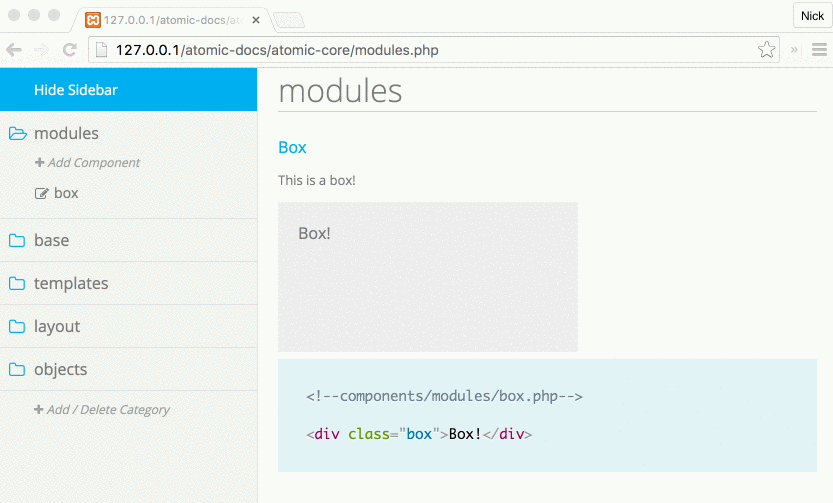
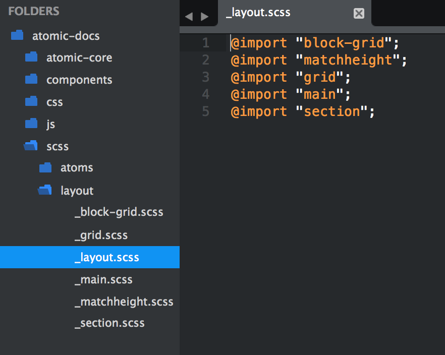

# Atomic Docs

Atomic Docs is a front end style guide generator and component manager. Atomic Docs is built in PHP and Sass. Inspired by Brad Frost's Atomic Design principles.

Atomic Docs works with Sass, Less and Stylus.

Documentation can be found at <a href="http://atomicdocs.io/">AtomicDocs.io</a>.

##Set up

1. Download Atomic Docs and add to your local PHP environment.
2. Configure your preprocessor to output `scss/main.scss` to `css/main.css`.
3. Go to `http://localhost/atomic-docs/atomic-core/index.php` and get started.

##Document
Have full documentation to hand off to other teams, internal or external.

##Edit in the Browser
Edit your components directly in the browser using the Ace.js editor.

##Organize
Organize all your components under categories that you name. "Base", "Modules", "Atoms" etc...

##Manage
Manage all your components. Move, rename and delete with a clean GUI interface.

##Save time
Does all the "wiring" of your SCSS partials. Never write `@import "partial-name";` again.

Documentation can be found at <a href="http://atomicdocs.io/">AtomicDocs.io</a>.

##Join the conversation!
We'd love to hear your thoughts and suggestions. Join us on <a href="https://nick578.typeform.com/to/NwX0ox">Slack</a>.

